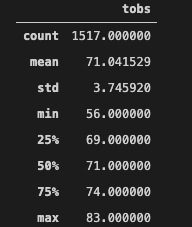

# surfs_up

## Purpose

The primary purpose of this project was to analyze weather patterns on the island of Oahu Hawaii to determine the viability of runnning a surf and ice cream shop. This data is to be used to attract investors.

## Resources

- Data Resources: hawaii.sqlite
- Software: Python 3.9.1, Visual Studio Code 1.51.1, jupyter-notebook 6.1.4, pandas, matplotlib, sqlalchemy, datetime

## Results

From the data tables below that were developed through analyzing the sqlite database, three observations can be made:

June Measurements

Decemeber Measurements

1. The tempurature ranges for both months appear to be within very similar ranges.
2. The average temperature for both months differs only by 3 degrees.
3. Both the ranges and the average temperatures indicate that this business would be successful.

## Summary

In summary, investing in the business would definitely be a profitable decision. However, it is important to note that investors might need to see more information in order to make their decision. Two follow up questions to expect and prepare for would be to explore the most ideal conditions for surfing and ice cream purchasing on the island, and explore what that would mean for the business. Also, another important detail to explore is the popularity of certain locations and the possibility of success based on the number of potential customers.